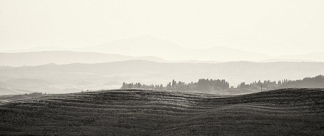

景深的几种表现形式

在摄影中，表现三维空间的极端手段便是立体摄影----用一架带有两个镜头的相机，对同一物体拍摄视角不同的两张照片。当一个人用一架体视镜看这两张视角不同的照片时，便可看到一幅三维空间的图象----就象人用两只视角不同的眼睛来看东西一样。

幸运的是，还有其它方法，用普通照相机来制造三维空间的图象。人的心理亦能使人用一只眼睛所得到的提示信息来感知景深和距离。通过运用下列单眼所获取的提示信息，你能够提高照片上的景深幻象。

1.直线透视

一般说来，表现距离最有力、最为常用的提示信息便是直线透视，简单地说，直线透视就是渐隐的、会聚的平行直线和平行平面。铁轨，公路，摩天大楼都表现了直线透视。你可以用广角镜头把前景线条和背景线条都摄入画面来夸大直线透视的感觉。

2.空间透视

空间透视所运用的是大气改变光线特征的原理。随着离光源的距离的增大，大气使光线更加分散，更加模糊，反差亦不断减弱。远处的物体会显得更蓝一点或更黄一点。这种效果在几英里宽阔的旷野上难以察觉，但在多烟雾的城区里则往往容易察觉。用黑白胶片拍摄时，用蓝滤光镜能使这种效果得以加强，用偏振镜片或用深黄色、桔黄色、红色滤光镜片则能减弱这种效果。用彩色胶片拍摄时，可用偏振镜片来减弱这种烟雾效果。

 

Photo by <a href="https://www.flickr.com/photos/rp_ang">Rebecca Ang</a> | <a href="https://www.flickr.com/photos/rp_ang/20595127701/">Photo URL</a>
