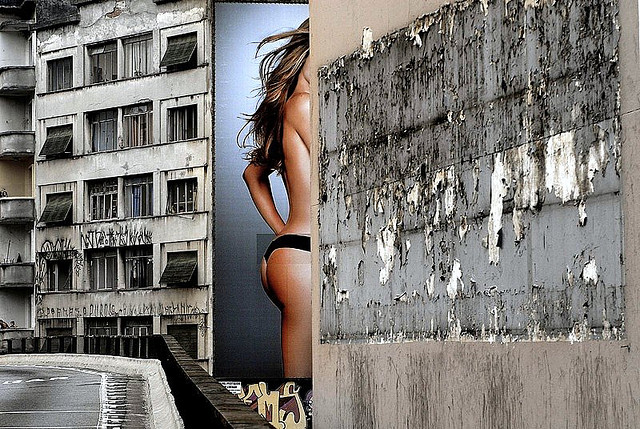

场景

一棵盛开的樱桃树。一棵在果园里盛开的樱桃树。一棵在错层式小屋前盛开的樱桃树。一棵在露天停车场中盛开的樱桃树。

每一件东西都有它自己的归宿，通常通过表现它们所处的场所，你可以更好地揭示主题的特性。

表现主题的最直接的方法就是在人们认为主体该呆的地方进行拍摄---如，树林中的野花，行驶在灯塔附近的帆船。虽然诸如此类的联系浅显易见而且并不十分重要，但是这些联系能够向人们解说，甚至能够唤起人们的兴趣，而且并不改变人们对主题的想法。人们期望一只小船在灯塔附近，那就让它在那儿吧。

有时我们可能希望看到主体（如灯塔）出现在某一特定的地方，当看到它出现在另一个新处所时就会感到惊奇。惊奇亦能使观赏者感到高兴，引起人们的注意。

不过，在人们并不知道该期望什么时，环境能够增强某些感觉，能够增加气氛，或者创造出对主题的一种新的感觉。例如，一张女人的半身肖像所表现的情调可能与她在富丽堂皇的“绿”房间休息时的照片完全不一样。

将主体选在外景地里拍摄所迫切需要解决的问题是，如何处理好画面上所增加的物体。这时面对的不只是一个物体，你需同时摆弄好三个、四个或五个物体，对那些物体如果处理不当，就会一团糟。而成功往往来自于好的视角的选择与构图。要仔细地琢磨，要使总体效果能够与你的设想相符，并能准确地表现出你的意图。

 

Photo by <a href="https://www.flickr.com/photos/zecacaldeira">zecacaldeira</a> | <a href="https://www.flickr.com/photos/zecacaldeira/2611301836/">Photo URL</a>
