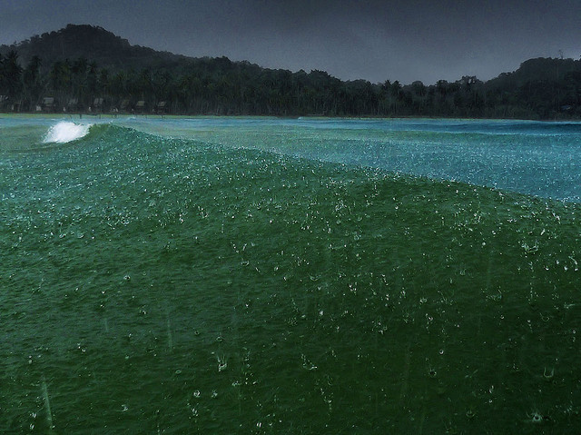

找岔子(续)

设备

你所用的镜头合适吗？变焦镜头在拍摄逆光的景物时眩光会比固定焦距的镜头更强烈。远摄镜头能在感觉上压缩距离；广角镜头则会使距离显得更大。你相机上的胶片速度表盘数据放得对吗？相机上曝光补偿控制用得合适吗？偏振镜片会增加色彩饱和度吗？

 

Photo by <a href="https://www.flickr.com/photos/visbeek">Ben The Man</a> | <a href="https://www.flickr.com/photos/visbeek/2777660363/">Photo URL</a>
