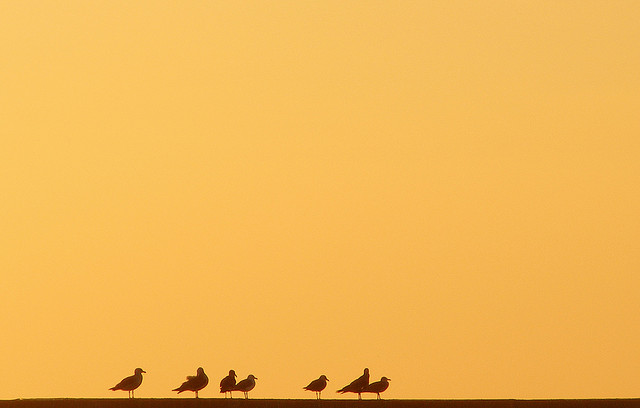

顺应自然

不要强使主题屈从你的思想方式--你不可能把一架钢琴从窗户里推出去。顺应自然吧；应该灵活些，适应环境吧。你将会在观赏你的照片时发现，景物是不会来适应你的。

事物是什么样就是什么样。只能与之合作，而不应与之冲撞。如果你原想给邻居家可爱的小姑娘拍一张魅力十足的肖像，而她却是一个淘气包的话，那你就该顺应自然，抓拍一张发辫掩住她的面孔，而她却在一个劲儿地咯咯笑个不停的照片。

不要让你的奢望用不切实际的幻想来使你饥渴难忍。放弃奢望，否定幻想。应使自己与景物协调起来，观察确实存在的东西，而不是你想观察的东西。然后再突出要点，拍出你要拍的照片来。

有时，一幅景观可能会被证明是无法拍摄的。如果这种情景存在的话，就该把它识别出来，然后就该高高兴兴地开步去找别的景物。

 

Photo by <a href="https://www.flickr.com/photos/patiblue">Pati</a> | <a href="https://www.flickr.com/photos/patiblue/2075028929/">Photo URL</a>
