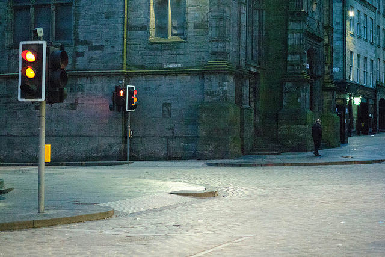

边框

如果你能保持眼球完全静止，当然这太不自然了，你就会发现人类的眼睛也是有边框的--有一个为眼框所定下的大致呈椭圆形的边界。但是在一般情况下，你总要对景物眨动眼睛的，所以事实上眼睛的视域是无边界的。

但是照片是有边界的。在取景时，你必须考虑边界对事物的作用。边界将事物圈入或是剔出画面。它限定了事物的上下左右；它用构图来制造形状；它可以使空间放大或者缩小。

摄影写作家在写书时，也一定要讨论边框。他们告诉你如何在边框内使画面得到平衡，如何使边框置于垂直或水平位置以适应垂直或水平的主体，告诉你如何使边框显得平整，如何使它不把主体挤到角落里去。这些都是传统的忠告，通常亦为人们所遵循。事实上也很有用。

 

Photo by <a href="https://www.flickr.com/photos/jonnydunbar">Jonathan Dunbar</a> | <a href="https://www.flickr.com/photos/jonnydunbar/16418987873/">Photo URL</a>
