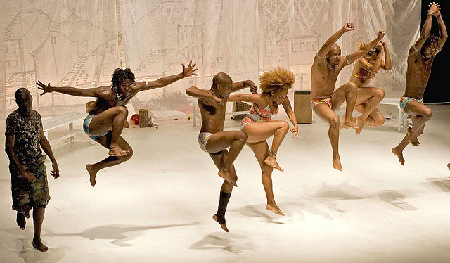

快门和动作

快门能捕捉到的动作，眼睛却不一定能看到。一个人所具有的与快门相接近的东西是眼睑。眼睑的眨动仅仅起了个擦玻璃窗的作用。其实眼睑与快门很相似，快门能够使运动凝住，也可以使动作显得模糊，或者甚至根本不在胶片上留下痕迹。这些都取决于快门的速度。另外，眼睛只能注意到一个运动物体的存在，并且跟踪它，并不能把个别的动作瞬间从一个连贯的动作中分离出来，也不能捕捉住一个模糊的动作图像，而这些照相机都能够做到。

摄影者往往因为反应太慢而不能对一个运动物体进行细察，因此只有多拍，才可能获得好的影像。就象赤手空拳去扑打一只蝴蝶一样，要努力多次才能抓住它。即使对某些没有运动的东西来说也是这样。如，肖像摄影并无运动，只有表情的变化，可拍摄者往往需要拍完整整一卷胶片，才能获得一张表情满意的肖像照片。

 

Photo by <a href="https://www.flickr.com/photos/uuaaii">ísis Martins</a> | <a href="https://www.flickr.com/photos/uuaaii/463912234/">Photo URL</a>
