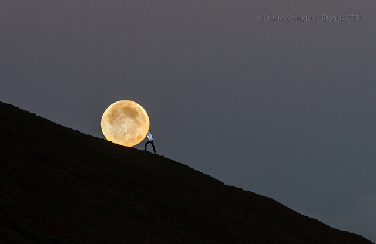

广角镜头

在拍摄距离较近的主体时，用广角镜头能增加物体间的空间感和距离感。焦距越短，空间夸张得越厉害。它能使近距离主体以及中距离主体明显地改变透视图像。

当远处的主体很小时，近处的主体就会在尺寸上显得大小正常，或者显得稍稍比平时大一些。这些近处与远处的大小差别能引起空间的夸张。

虽然用广角镜头拍摄会使肖像变成漫画，使摩天大楼显得过于高大。但其效果是十分明显的，扩大的空间不仅看上去会显得近乎正常，而且还能制造出很强的景深感。通过对近处和远处主体的精心选择和安置，你能把人们的视觉重心从距离位置移到大小尺寸变化上来。例如，你能使前景中的蒲公英变成一棵高耸于背景中人物头上的参天红松。在强调异常的大小尺寸关系时，必须用28毫米或集中更短的镜头，并且将光圈置于f/16那样的小光圈上，以获得足够的景深。

 

Photo by <a href="https://www.flickr.com/photos/emiliorodriguez">Emilio Rodríguez</a> | <a href="https://www.flickr.com/photos/emiliorodriguez/15564687750/">Photo URL</a>
