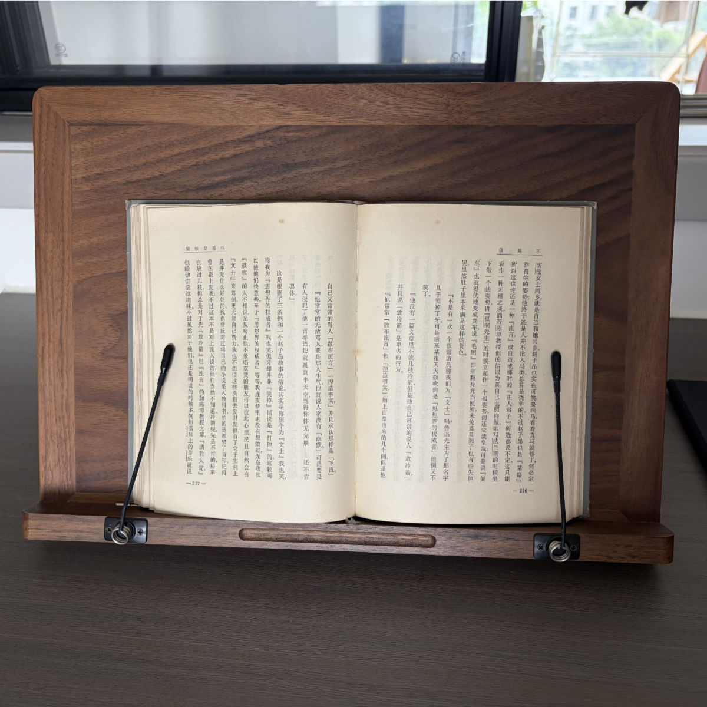
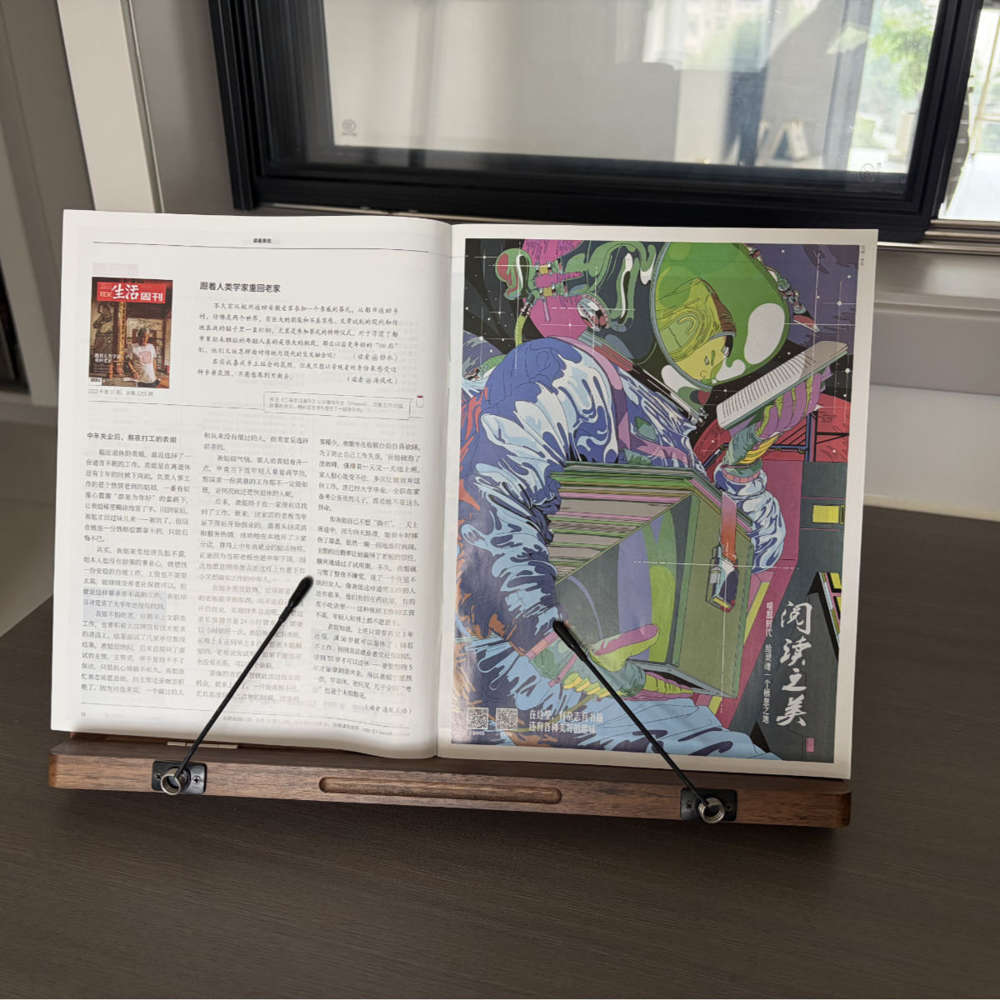

## 胡桃木阅读支架

<table border="0" align="center" cellpadding="3" cellspacing="0"><tr> <td width=50%></td><td width=50%></td></tr></table>

当时想买这个阅读支架是因为偶然在电视剧里看到。

我觉得需要，一是因为实体书与杂志仍然是我阅读的重要部分，还有大约 50%是电子阅读，使用电子书、iPad Pro，我很少在手机上看书。

二是这个支架的胡桃木材质与我书桌暗色纹系还挺搭。

我买的大号尺寸，适合放在家里的书桌上，不适合外出携带。

阅读效果还是不错的。特别是较厚的书籍（拿在手里太重），还有规格尺寸较大的杂志，平摊在书架上，就象一幅画，观看效果更好，读起来也更方便轻松。

价格（淘宝）：129元  
购买时间：2025-3-31

{{ image: ../images/gear/reading-stand-3.jpg }}
{{ image: ../images/gear/reading-stand-4.jpg }}
