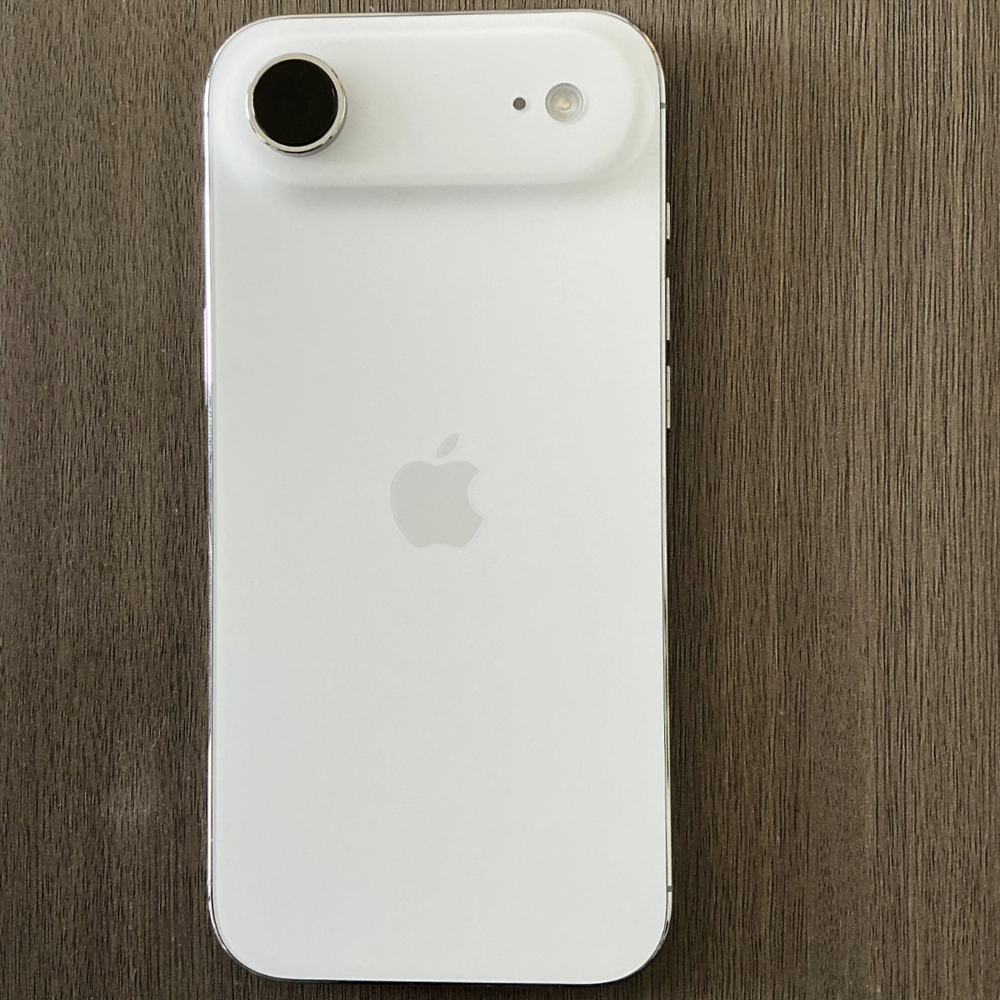
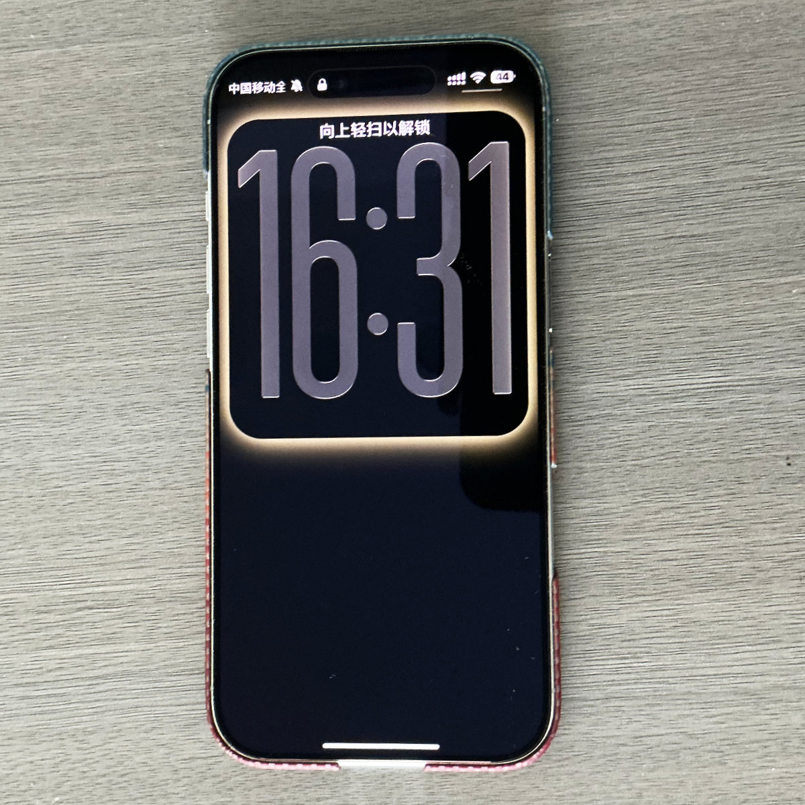
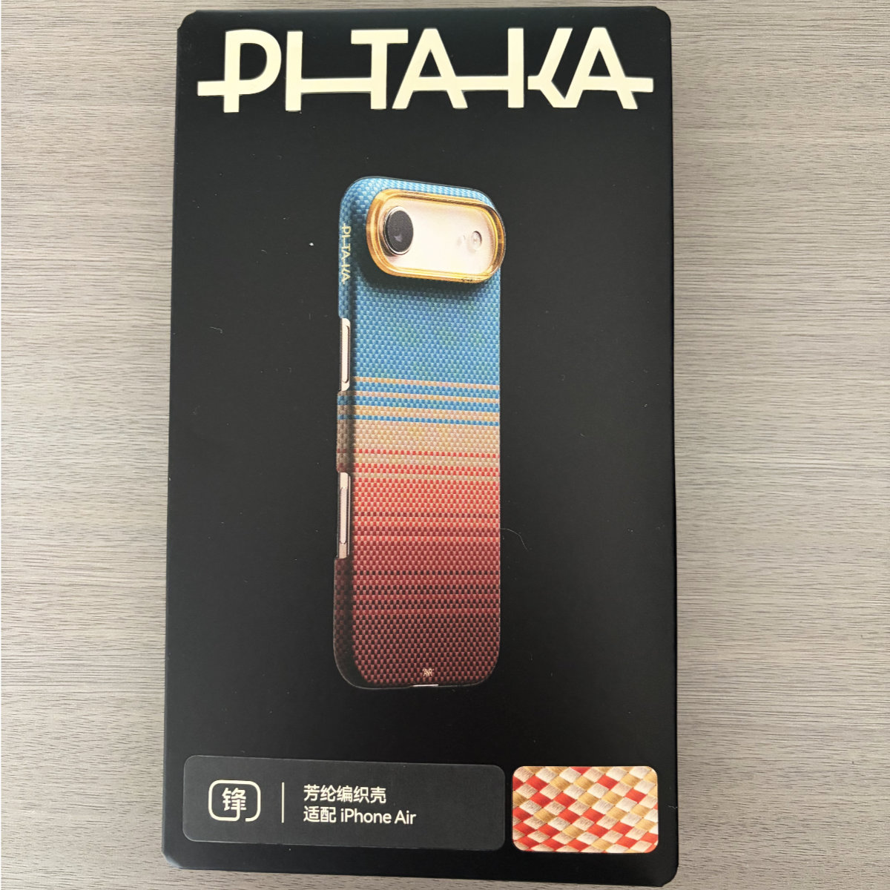
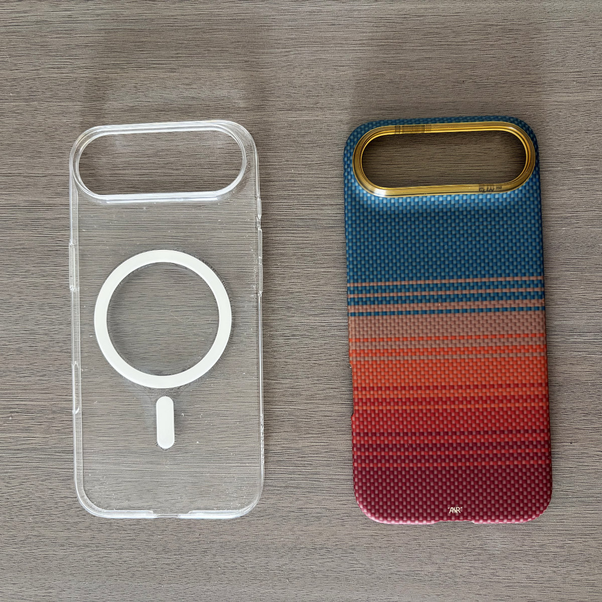
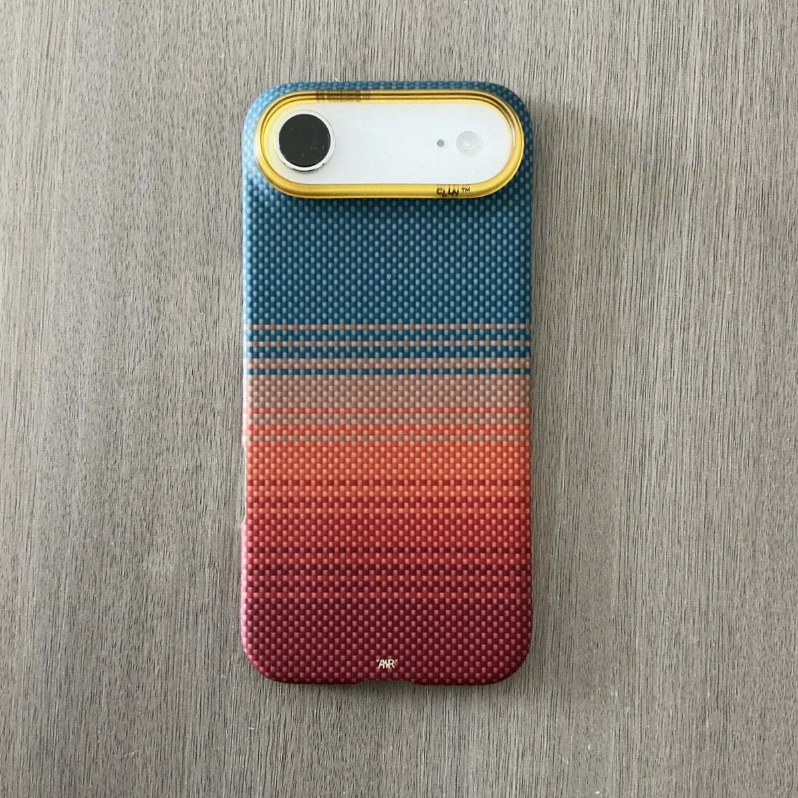
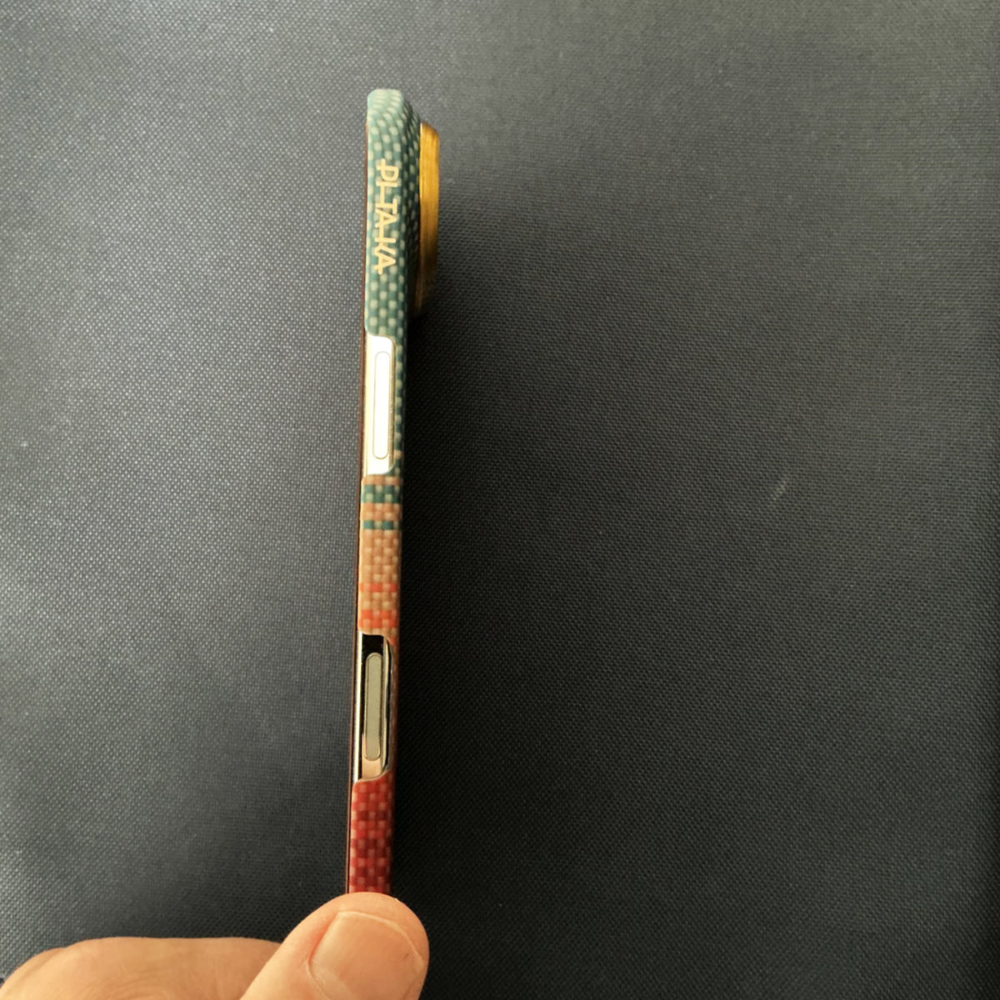

---
title:我为什么选择 iPhone Air 
date: 2026-06-21
category: 七种武器
summary: Air 最吸引我的是超薄的造型。超瓷晶面板的屏幕比 Pro 稍大，厚度是“迄今最薄”的 5.6 毫米，轻仅165克。而且配备 Pro 级芯片。
lead: 少即是多，有所取舍是一种人生哲学。
thumbnail: ../images/gear/iphone-air-1.jpg
gear_note: 超薄超轻超棒手感iPhone air
---

## 我为什么选择 iPhone Air 

在2025年苹果公司的秋季发布会上，当我看到 iPhone Air 的宣传片时，就知道我的下一台手机可能就是它了。

<table border="0" align="center" cellpadding="3" cellspacing="0"><tr> <td width=50%></td><td width=50%></td></tr></table>

Air 最吸引我的是超薄的造型。超瓷晶面板的屏幕比 Pro 稍大，厚度是“迄今最薄”的 5.6 毫米，轻仅165克。而且配备 Pro 级芯片（图形处理器5核，Pro为6核）

在苹果直营店看到 Air 真机时，个人最喜欢的是白色，握在手里质感很爽，对我这种注重设计感的人而言是很难抵挡的诱惑。

再来说说网上对 Air 诟病最多的几点。

一是充电口传输数据时的协议是 USB2.0，说实话这是当时我知道这个消息时最无法忍受的，要知道USB2.0与目前主流的 3.0、3.2相比差得很远，当你实际对比过两者的传输速度时就会明白。但后来一想，我使用手机这么多年，似乎从未使用过数据线去传输数据，尤其是当我买了 iCloud 订阅以后，iPhone、Macbook、iPad 数据通过 iCloud 共享。通过数据线传输数据？有点象“上古时代”的操作。这样想的时候突然觉得这个问题已经无足轻重了。

二是单扬声器的问题。对于只有一台手机的人来说，这确实是个问题。但对我来说，这根本不是问题。因为我从不在手机上玩游戏（Mac 游戏我一般会在 iPad 或 Apple TV 上连接手柄玩），也几乎从不在手机上外放音乐（我对音乐播放要求很高，要么连接耳机，要么连接音箱）。打电话、试听音频Demo，单扬声器根本不重要。

三是单摄像头的问题。这对我来说似乎也不是问题，就象我作为一名摄影发烧友来说，一镜走天涯有所取舍才是正解。Air 虽然只有一枚主摄，但对平时功能性使用已足够了，当然拍照时没有微距与远摄，也有人认为，舍弃微距与远摄的选项，集中精神用好这只主摄，未必不是件好事。

四是续航问题。从我使用到现在的经验，前提是很少玩游戏，很少刷抖音，但我对微信、企业微信使用较多。Air 的续航表现其实还不错，基本上都能撑到晚上回去再充电，为了以防万一，我另买了一块磁吸充电宝，这样就万无一失了。

最后再说说取消实体卡槽与首次使用C1X调制解调器。eSIM 目前支持得非常好，至少我这里从没掉过链子，跟用实体卡感觉不到区别。然后这个C1X的苹果自研5G基带，我个人体验非常好，似乎信号比以前确实有所提升。以前最怕开车出车库交停车费时因为信号不好手机转个不停，自从使用 Air 以来，似乎没遇到过这种情况。

我是在2026年1月底，苹果官方降价时购入的 iPhone Air，搭配上今天新买的 PITAKA 手机壳，超薄超轻超棒的握持感让我觉得这是一次正确的选择。

<table border="0" align="center" cellpadding="3" cellspacing="0"><tr> <td width=50%></td><td width=50%></td></tr></table>

这是我目前使用的两款手机壳，透明壳和今天新买的芳纶纤维编织凯夫拉超薄保护壳。

<table border="0" align="center" cellpadding="3" cellspacing="0"><tr> <td width=50%></td><td width=50%></td></tr></table>

